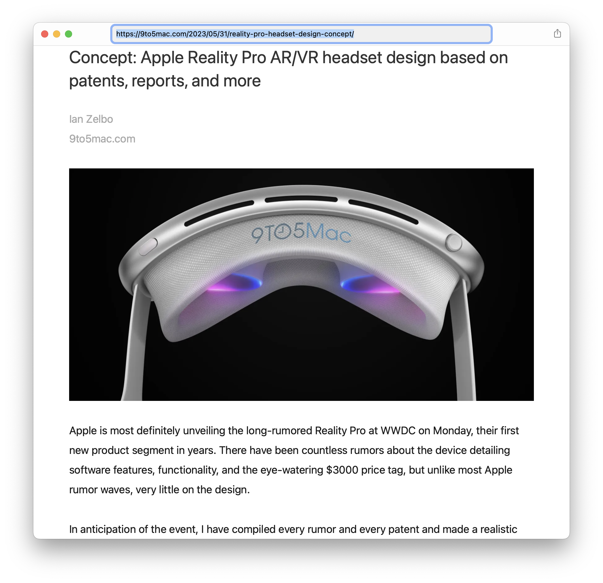

**Important:** This repository is currently public, but it may only be public for a short period of time. I will likely revoke this app’s access token to the Webpage Text API soon. That will break this app. I just made the app public to simplify sharing it with a small number of people.

This is a Mac app called Read. It displays article content from a webpage in a manner similar to Safari’s Reader View. It uses my [Webpage Text API](https://www.goldenhillsoftware.com/webpage-text-api/) to get article content without the junk (chrome, navigation, ads, and scripts) that tends to clutter modern webpages.  

I wrote this app to demonstrate my ability to write a Mac app in Objective-C. All the code in this app is written in Objective-C and uses AppKit.

## Nice touches in the app:

* The app supports light mode and dark mode.
* The app can be opened with a `read-http://` URL or `read-https://` URL. For example the `read-https://www.goldenhillsoftware.com/2022/06/announcing-unread-30-and-unread-cloud/` URL opens the app with my announcement of Unread 3.0 and Unread Cloud.
* The app includes a share extension. When on a webpage in Safari or another browser, open the share menu or popover and select “Read”. This app will open with the article content of the webpage.
* The app supports state restoration.
* The app preloads an access token for the service when it is likely that the user is about to request article content for a new webpage: when the user launches the app, when the user creates a new empty window, and when the user selects Open Location from the File menu.

## Areas for improvement:

* The app only stores access tokens for the webpage text service in memory. Storing access tokens in the keychain would allow the app to reuse a still-valid access token after the app is quit and reopened.
* Caching of Webpage Text API responses would let the app redisplay article content faster.
* I did not implement robust error handling in the share extension around handling non-HTTP(S) URLs, retrieving the URL from the extension context, or an inability to open the app with a URL.
* VoiceOver works, but there is no ability to change the text size of the displayed article.

## External Code

I created the icon based on [this reader icon](https://thenounproject.com/icon/reader-2654728/). I purchased a royalty-free license from The Noun Project.

This app uses [Google Toolbox for Mac](https://github.com/google/google-toolbox-for-mac) for HTML encoding. Google Toolbox for Mac is licensed under the Apache License (Version 2.0). Ordinarily I might use Swift Package Manager or Carthage to incorporate this. However this app needs a tiny subset of that library’s code. I also wanted to make it very easy for folks to checkout and run the app. So I copied the code I needed from Google Toolbox for Mac directly into this app.

The CSS is adapted from code in [Unread](https://www.goldenhillsoftware.com/unread/), my RSS reader. I own the copyright to the CSS except for some MIT-licensed snippets, but I did not write all of it. Some of the CSS was generated at runtime by Unread. Some was written by prior developers of Unread.